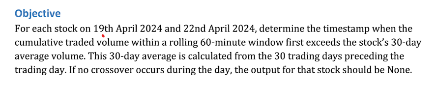
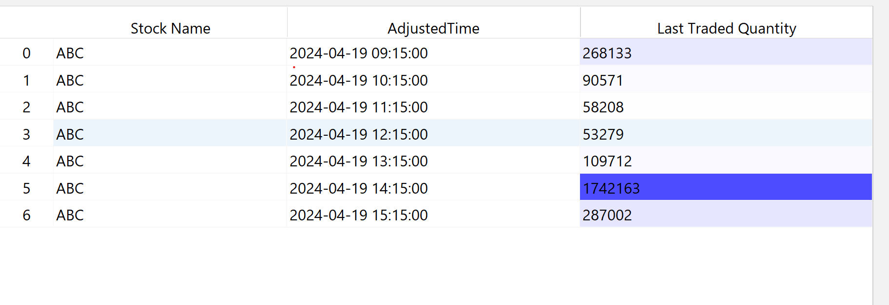
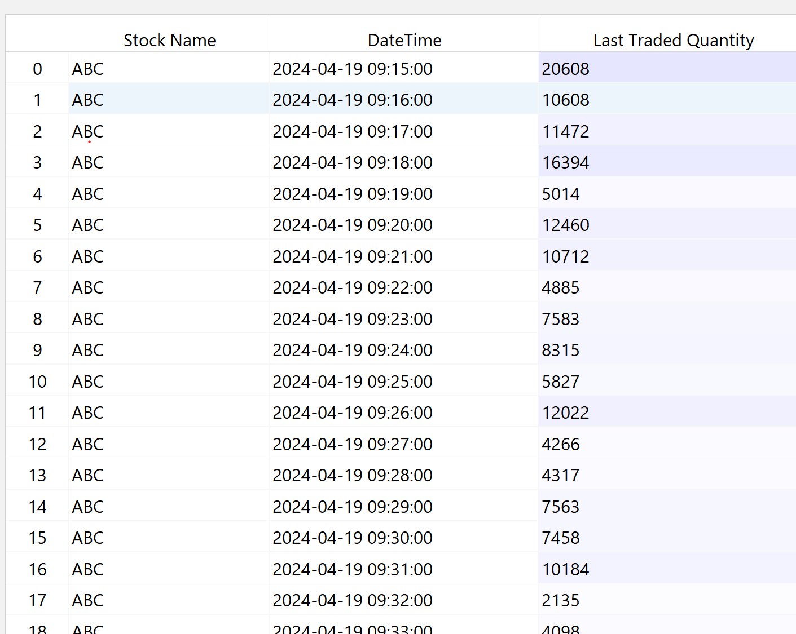

# Stock Volume Strategy

This project calculates the timestamp when the cumulative traded volume within a rolling 60-minute window first exceeds the stock's 30-day average volume. It processes intraday data and compares it with daily stock trading data.

## Folder Structure

- `data/`: Contains the data files (`day_data.csv`, `intraday_19_april_2024.csv`, `intraday_22_april_2024.csv`).
- `src/`: Contains the Python code (`stock_volume_strategy.py`).
- `requirements.txt`: Lists the Python dependencies (e.g., pandas).
- `main.py`: Entry point for executing the strategy.

## Requirements

- Python 3.x
- pandas

## How to Run

1. Install dependencies:
    ```
    pip install -r requirements.txt
    ```

2. Run the program:
    ```
    python main.py
    ```
   
3.Analysis
      
   "Hourly Time Frame"
   
      
   "Minutes Time Frame"
   
   